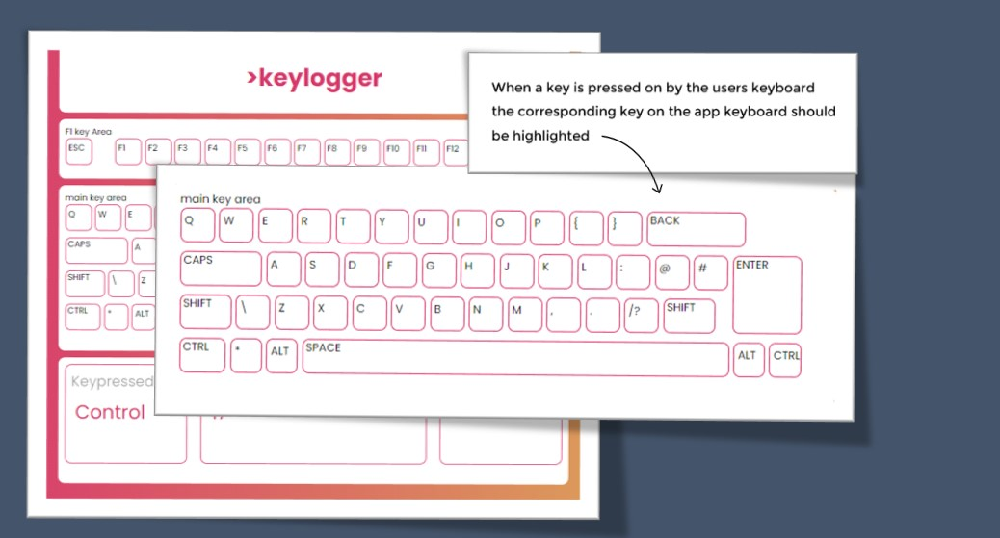

# 😎 Keylogger 
<br>


> ### This was a playful application I created using HTML and CSS JavaScript.  Once I was exposed to the ```document.addEventListener()``` which is a method used in JavaScript to attach an event listener to a specific element in a web page I decided to challenge myslef and see if I could create a keyboard inspired app to log key presses.

## 🎯 Link 
 https://ajdevbox.github.io/keylogger/
 
## 🛠 Mock Design in Figma


## ⌨ HTML Structure / CSS Design 


Creating the mock up design of the keyboard in Figma helped me think about how I was going to structure the HTML Markup.  As you can see from the code snippets I decided to use a number of divs to create sections for each area of the keyboard such as the f1 keys the numbers and the main keyboard area.  

The CSS part was really fun and frustrating at the same time but researching how to use flexbox and using the ```border-radius: 10px```; css property made the keyboard pop.   At this stage I wasn’t sure how I would link the user interaction


## Javascript 

## Challenges & Key Learning


