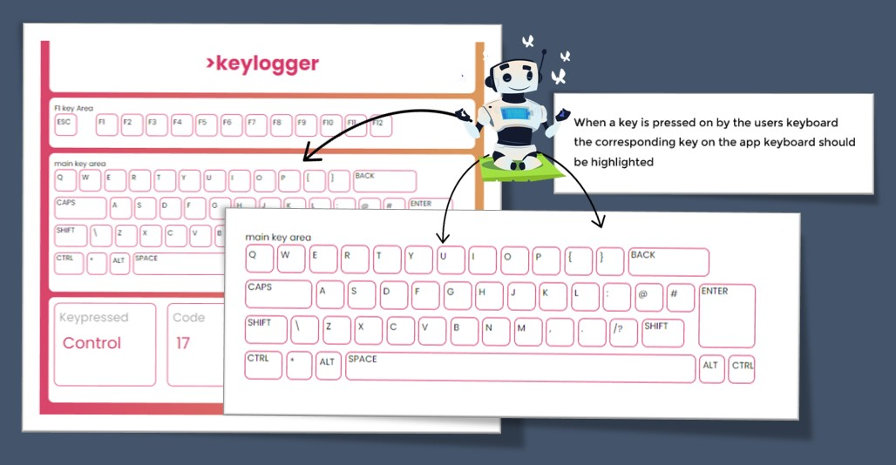

# 😎 Keylogger 
<br>
This was a playful application I created using HTML and CSS JavaScript.  Once I was exposed to the document.addEventListener() which is a method used in JavaScript to attach an event listener to a specific element in a web page.  I decided to challenge myslef and see if I could create a keyboard inspired app to log key presses.

### 🛠 Mock Design in Figma


## ⌨ HTML Structure & CSS Design 


Creating the mock up design of the keyboard in Figma helped me think about how I was going to structure the HTML Markup.  As you can see from the code snippets I decided to use a number of ```<div></div>``` to create sections for each area of the keyboard such as the F1 keys, number keys and the main keyboard area.  

The CSS part was really fun and fustrating at the same time but researching how to use flexbox and using the ```border-radius: 10px```; css property made the keyboard pop.   At this stage I wasn’t sure how I would link the user interaction to vsiualise which key has been pressed.  

## 💎 Javascript 

Using the document.addEventListener() method to listen for the "keyup" event. When a key is released on the users keyboard, the function is executed, retrieving the corresponding element using a ID specfifed and then using document.getElementById() and assigning it to the const variable.  This was like magic to me that I finally started to experince how to manipulate and interact with the DOM 🧩

## ⚙ Functions 

Rather than using a list a if else statements I looked into using switch statements using various resources online and found this to be the best fit for what I wanted to achieve.  Staying true to what was taught in week 1 of School of Code Bootcamp I could hear the coaches voice in the background.....

   break down the problem statement and write out the tasks that your trying to solve in plain english   

Once I was able to capture the key event press it was easy to store this in a variable to be used in the switch case to evalute and the perform  a case block.  In this app it was to listen out for a keypress value and then change the style of the button.  

I create a function called toggleclass to change the CSS classes of the buttons, which in turn modifies their appearance. It applies a class to a button to indicate that it has been pressed, and after a short delay, it reverts the button back to its original appearance. 

This part took me a while to figure out but as taught in on the School of Code bootcamp break the problem down into small parts 


## ✍ Challenges & Key Learning
Key takeaways for this little project was to really think about what the code is doing and don’t forget to include the break statement in all case.


I missed the opportunity to use root variables in the CSS and maybe think about using better naming conventions for CSS class names as I confused myself when I took a few days break and returned back to look at the code base 😅

      Really enjoyed learning about flex box and switch statments and look forward to using some CSS frameworks 

## 🎯 Link 

      https://ajdevbox.github.io/keylogger/

##  


